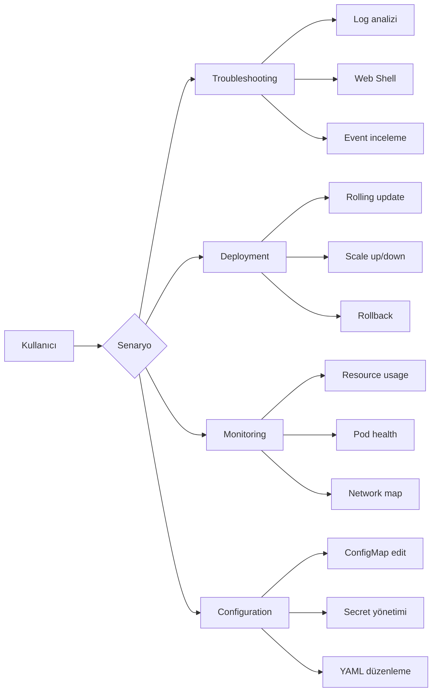
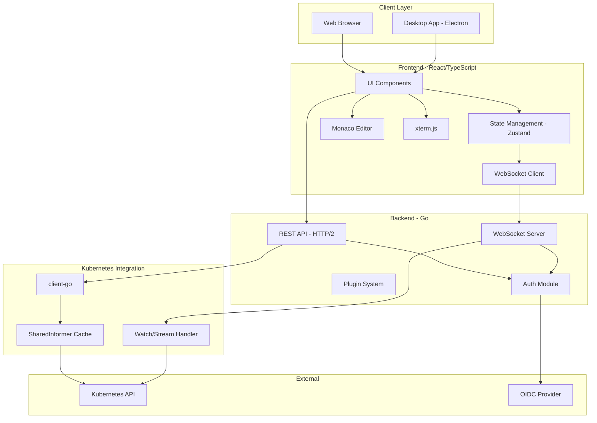
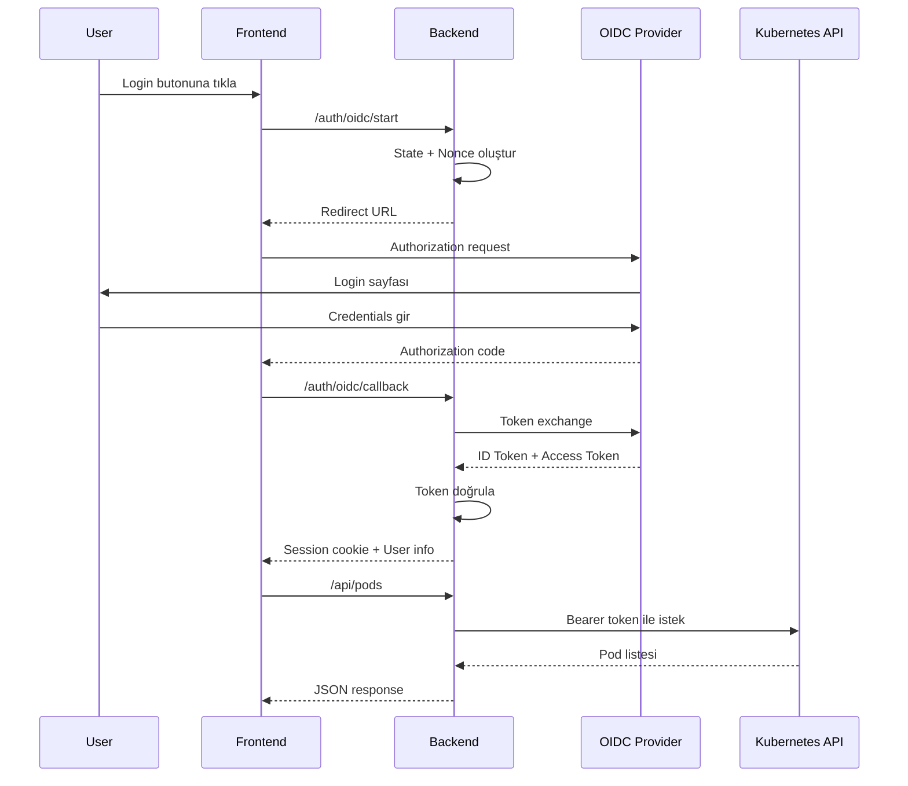
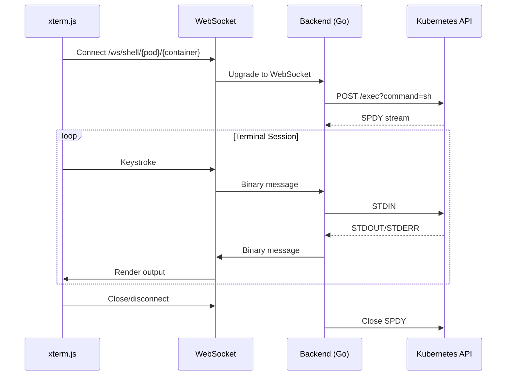
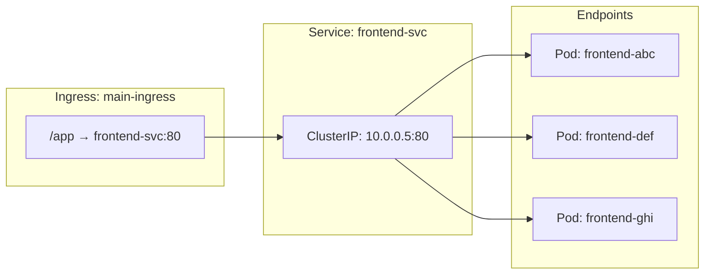
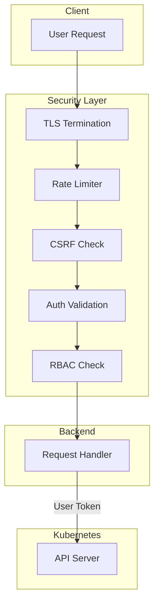
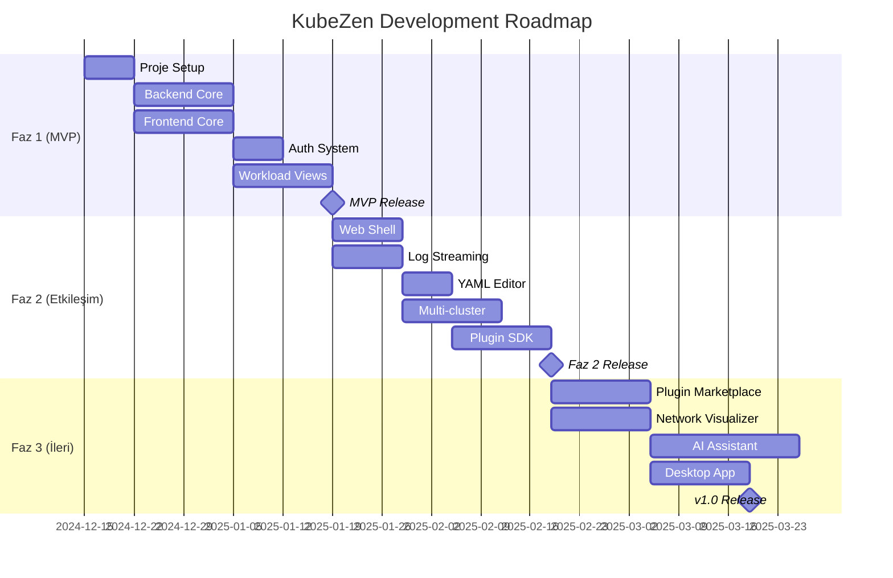

# KubeZen - Product Requirements Document (PRD)

> **Proje Kod Adı:** KubeZen 
> **Versiyon:** 1.0  
> **Tarih:** 2024-12-05  
> **Durum:** Taslak

---

## 📋 İçindekiler

1. [Yönetici Özeti](#1-yönetici-özeti)
2. [Proje Vizyonu ve Hedefleri](#2-proje-vizyonu-ve-hedefleri)
3. [Hedef Kullanıcılar](#3-hedef-kullanıcılar)
4. [Rekabet Analizi](#4-rekabet-analizi)
5. [Teknik Mimari](#5-teknik-mimari)
6. [Fonksiyonel Gereksinimler](#6-fonksiyonel-gereksinimler)
7. [Non-Fonksiyonel Gereksinimler](#7-non-fonksiyonel-gereksinimler)
8. [Güvenlik Gereksinimleri](#8-güvenlik-gereksinimleri)
9. [Feature Roadmap](#9-feature-roadmap)
10. [Başarı Metrikleri](#10-başarı-metrikleri)
11. [Riskler ve Azaltma Stratejileri](#11-riskler-ve-azaltma-stratejileri)

---

## 1. Yönetici Özeti

### 1.1 Problem Tanımı
Kubernetes ekosisteminde mevcut dashboard çözümleri kritik eksiklikler barındırmaktadır:

| Problem | Etki |
|---------|------|
| **Yüksek kaynak tüketimi** | Masaüstü IDE'ler RAM ve CPU yoğun |
| **Sınırlı web arayüzleri** | Temel özellikler, zayıf UX |
| **Karmaşık kurulum** | Kong gateway gibi bağımlılıklar |
| **Ölçeklenebilirlik sorunu** | 10.000+ pod'da performans düşüşü |
| **Ticarileşme riski** | OpenLens örneği - temel özelliklerin ücretli hale gelmesi |

### 1.2 Çözüm Özeti
**KubeZen**, yüksek performanslı, tamamen açık kaynaklı, web-öncelikli bir Kubernetes dashboard'dur:

- 🚀 **10.000+ pod** desteği ile milisaniye yanıt süreleri
- 🔌 **Modüler eklenti sistemi** ile genişletilebilirlik
- 🔒 **Enterprise-grade güvenlik** (OIDC, RBAC, Zero-Trust)
- 🌐 **Web-first, Desktop-ready** hibrit mimari
- 📦 **Tek binary/Helm** ile kolay kurulum

---

## 2. Proje Vizyonu ve Hedefleri

### 2.1 Vizyon
> "Lens'in kullanıcı deneyimi, Headlamp'in genişletilebilirliği ve Skooner'in hafifliğini birleştiren, kurumsal ölçekte web öncelikli bir Kubernetes arayüzü."

### 2.2 Stratejik Hedefler

| Hedef | Açıklama | Başarı Kriteri |
|-------|----------|----------------|
| **Performans** | Büyük ölçekli cluster'larda sorunsuz çalışma | 10K+ pod ile <100ms yanıt |
| **Erişilebilirlik** | Web tabanlı, her yerden erişim | Mobil uyumlu responsive UI |
| **Açık Kaynak** | Topluluk güveni ve katkısı | Apache 2.0 / MIT lisansı |
| **Genişletilebilirlik** | Eklenti ekosistemi | SDK + Plugin marketplace |
| **Kurulum Kolaylığı** | Minimal bağımlılık | 5 dakikada production-ready |

### 2.3 Anti-Hedefler (Out of Scope)
- ❌ Kubernetes cluster kurulumu/yönetimi (K3s, kind gibi)
- ❌ CI/CD pipeline yönetimi (ArgoCD, Flux sadece eklenti olarak)
- ❌ Container registry yönetimi
- ❌ Multi-cloud provisioning

---

## 3. Hedef Kullanıcılar

### 3.1 Persona Tanımları

#### 🧑‍💻 DevOps Mühendisi (Ahmet)
- **Deneyim:** 3-5 yıl Kubernetes
- **İhtiyaçlar:** Hızlı troubleshooting, log analizi, pod restart
- **Pain Points:** CLI'dan yoruldu, IDE çok ağır
- **Beklenti:** Hızlı arama, web shell, gerçek zamanlı loglar

#### 🏢 Platform Mühendisi (Elif)
- **Deneyim:** 5+ yıl, enterprise ortam
- **İhtiyaçlar:** Multi-cluster yönetimi, RBAC, audit
- **Pain Points:** Farklı araçlar arası geçiş, güvenlik uyumu
- **Beklenti:** Merkezi yönetim, SSO, eklenti desteği

#### 🎓 Junior Developer (Can)
- **Deneyim:** 0-2 yıl
- **İhtiyaçlar:** Görsel arayüz, öğrenme kolaylığı
- **Pain Points:** kubectl komutları karmaşık
- **Beklenti:** Sezgisel UI, yardımcı tooltips, görselleştirme

### 3.2 Kullanım Senaryoları



---

## 4. Rekabet Analizi

### 4.1 Karşılaştırma Matrisi

| Özellik | K8s Dashboard | OpenLens | Headlamp | Skooner | **KubeZen** |
|---------|---------------|----------|----------|---------|-------------|
| **Mimari** | Web (cluster) | Desktop | Hibrit | Web | **Hibrit (web-first)** |
| **10K+ Pod** | ❌ Düşük | ⚠️ RAM yoğun | ⚠️ Orta | ❌ Düşük | ✅ **Sanal liste** |
| **Kurulum** | ❌ Kong gerekli | ✅ Yerel | ⚠️ Orta | ✅ Kolay | ✅ **Tek binary** |
| **Eklenti** | ❌ Yok | ⚠️ Sınırlı | ✅ Güçlü | ❌ Yok | ✅ **Tam modüler** |
| **Multi-cluster** | ❌ Zayıf | ✅ Güçlü | ⚠️ İyi | ❌ Yok | ✅ **Merkezi** |
| **Web Shell** | ⚠️ Temel | ✅ Var | ⚠️ Var | ❌ Yok | ✅ **xterm.js** |
| **Log Streaming** | ⚠️ Temel | ✅ Var | ⚠️ Var | ⚠️ Temel | ✅ **WebSocket** |
| **Lisans** | Apache 2.0 | MIT (kısıtlı) | Apache 2.0 | Apache 2.0 | ✅ **MIT** |

### 4.2 Rekabetçi Avantajlar

1. **Performans:** SharedInformer + Virtual List = 10K+ pod sorunsuz
2. **Hafiflik:** Tek Go binary, minimal dependency
3. **Açık Kaynak Güvencesi:** Hiçbir özellik ücretli olmayacak
4. **Modern UX:** Lens benzeri deneyim, web erişilebilirliği
5. **Eklenti Ekosistemi:** SDK ile topluluk katkısı

---

## 5. Teknik Mimari

### 5.1 Yüksek Seviye Mimari



### 5.2 Teknoloji Yığını

| Katman | Teknoloji | Gerekçe |
|--------|-----------|---------|
| **Backend** | Go 1.22+ | Kubernetes native, düşük bellek, goroutine |
| **API** | client-go | Resmi SDK, SharedInformer pattern |
| **Web Framework** | Gin / Echo | Performans, middleware desteği |
| **Frontend** | React 18 + TypeScript | Bileşen bazlı, tip güvenliği |
| **State** | Zustand | Hafif, DevTools desteği |
| **UI Kit** | shadcn/ui + Tailwind | Modern, erişilebilir |
| **Charts** | Recharts / Nivo | React native, performanslı |
| **Editor** | Monaco Editor | VS Code kalitesinde YAML |
| **Terminal** | xterm.js | Gerçek terminal emülasyonu |
| **WebSocket** | gorilla/websocket | Stabil, yaygın kullanım |
| **Desktop** | Electron (Faz 2+) | Cross-platform |

### 5.3 Performans Optimizasyonları

#### Backend (Informer Pattern)
```
┌──────────────────────────────────────────────────────┐
│                    Kubernetes API                      │
└─────────────────────┬────────────────────────────────┘
                      │ LIST + WATCH
                      ▼
┌──────────────────────────────────────────────────────┐
│              SharedInformer + Delta FIFO              │
│  ┌─────────────┐  ┌─────────────┐  ┌─────────────┐  │
│  │ Pod Cache   │  │ Node Cache  │  │ Deploy Cache│  │
│  └─────────────┘  └─────────────┘  └─────────────┘  │
│                                                       │
│  SetTransform: managedFields, status gibi            │
│  gereksiz alanlar filtrelenir                        │
└─────────────────────┬────────────────────────────────┘
                      │ Delta events
                      ▼
┌──────────────────────────────────────────────────────┐
│              WebSocket Broadcast                       │
│  Sadece değişen kaynaklar istemcilere iletilir       │
└──────────────────────────────────────────────────────┘
```

#### Frontend (UI Virtualization)
```
┌─────────────────────────────────┐
│        Visible Viewport          │ ← Sadece görünür 20-30 satır
│  ┌──────────────────────────┐   │   render edilir
│  │ Pod 100                   │   │
│  │ Pod 101                   │   │
│  │ Pod 102                   │   │
│  │ ...                       │   │
│  │ Pod 120                   │   │
│  └──────────────────────────┘   │
└─────────────────────────────────┘
          ▲
          │ react-window
          │
┌─────────────────────────────────┐
│     Virtual List (10K+ items)    │
│  Memory: O(viewport) not O(n)    │
│  FPS: 60 sustained              │
└─────────────────────────────────┘
```

---

## 6. Fonksiyonel Gereksinimler

### 6.1 Kimlik Doğrulama ve Yetkilendirme (AuthN/AuthZ)

| ID | Gereksinim | Öncelik | Açıklama |
|----|------------|---------|----------|
| **FR-AUTH-01** | OIDC Entegrasyonu | P0 | Keycloak, Google, Okta, Azure AD desteği |
| **FR-AUTH-02** | Kubeconfig Desteği | P0 | ~/.kube/config okuma, context switch |
| **FR-AUTH-03** | Service Account Token | P1 | Manuel JWT girişi |
| **FR-AUTH-04** | Impersonation | P1 | Kullanıcı token'ı ile API çağrısı |
| **FR-AUTH-05** | Session Yönetimi | P0 | Güvenli cookie, timeout |

#### Detaylı Akış: OIDC Login


---

### 6.2 İş Yükü (Workload) Yönetimi

| ID | Gereksinim | Öncelik | Açıklama |
|----|------------|---------|----------|
| **FR-WORK-01** | Pod Listeleme | P0 | Tüm namespace, filtreleme, arama |
| **FR-WORK-02** | Pod Detay | P0 | Status, events, containers, volumes |
| **FR-WORK-03** | Deployment Yönetimi | P0 | List, scale, rollback, restart |
| **FR-WORK-04** | StatefulSet Yönetimi | P1 | List, scale, ordinal bilgisi |
| **FR-WORK-05** | DaemonSet Yönetimi | P1 | List, update strategy |
| **FR-WORK-06** | Job/CronJob | P1 | List, trigger, suspend |
| **FR-WORK-07** | ReplicaSet | P2 | Görüntüleme, revizyon bilgisi |

#### Pod List UI Özellikleri
- [x] Virtual scroll (10K+ satır)
- [x] Multi-column sort
- [x] Global search
- [x] Namespace filter
- [x] Status filter (Running, Pending, Failed, etc.)
- [x] Label selector
- [x] Age gösterimi (relative time)
- [x] Quick actions (delete, logs, shell)
- [x] Bulk operations
- [x] Column customization

---

### 6.3 Log Yönetimi

| ID | Gereksinim | Öncelik | Açıklama |
|----|------------|---------|----------|
| **FR-LOG-01** | Real-time Streaming | P0 | WebSocket ile canlı log |
| **FR-LOG-02** | Multi-container | P0 | Container seçimi |
| **FR-LOG-03** | Previous Logs | P0 | Crash olmuş container logları |
| **FR-LOG-04** | Log Search | P1 | Regex, case-insensitive |
| **FR-LOG-05** | Log Filter | P1 | Severity, timestamp |
| **FR-LOG-06** | Log Download | P2 | TXT, JSON export |
| **FR-LOG-07** | Log Wrap | P0 | Word wrap toggle |
| **FR-LOG-08** | Timestamp Toggle | P0 | Zaman damgası göster/gizle |
| **FR-LOG-09** | Auto-scroll | P0 | Tail -f benzeri |
| **FR-LOG-10** | Color Coding | P1 | ERROR kırmızı, WARN sarı |

---

### 6.4 Terminal Erişimi (Web Shell)

| ID | Gereksinim | Öncelik | Açıklama |
|----|------------|---------|----------|
| **FR-TERM-01** | Pod Shell | P0 | sh/bash/zsh seçimi |
| **FR-TERM-02** | Container Seçimi | P0 | Multi-container pod desteği |
| **FR-TERM-03** | Full Terminal | P0 | Copy/paste, scroll, resize |
| **FR-TERM-04** | Session Persist | P1 | Tab değişince korunma |
| **FR-TERM-05** | Multi-tab | P1 | Birden fazla terminal |
| **FR-TERM-06** | Split View | P2 | Yan yana terminaller |

#### Teknik Akış


---

### 6.5 Ağ Yönetimi

| ID | Gereksinim | Öncelik | Açıklama |
|----|------------|---------|----------|
| **FR-NET-01** | Service List | P0 | ClusterIP, NodePort, LoadBalancer |
| **FR-NET-02** | Ingress List | P0 | Rules, TLS, backend mapping |
| **FR-NET-03** | Endpoint Görüntüleme | P1 | Pod-Service eşleştirmesi |
| **FR-NET-04** | Network Policy | P2 | Görselleştirme, ingress/egress |
| **FR-NET-05** | Service Mesh | P3 | Istio/Linkerd entegrasyonu (eklenti) |

#### Service-Pod İlişki Görselleştirmesi


---

### 6.6 Depolama Yönetimi

| ID | Gereksinim | Öncelik | Açıklama |
|----|------------|---------|----------|
| **FR-STOR-01** | PV List | P1 | Capacity, access modes, status |
| **FR-STOR-02** | PVC List | P1 | Bound status, storage class |
| **FR-STOR-03** | PVC-Pod Mapping | P1 | Hangi pod kullanıyor |
| **FR-STOR-04** | StorageClass | P1 | Default, provisioner, parameters |
| **FR-STOR-05** | Capacity Planning | P2 | Usage grafikleri (eklenti) |

---

### 6.7 Konfigürasyon Yönetimi

| ID | Gereksinim | Öncelik | Açıklama |
|----|------------|---------|----------|
| **FR-CONF-01** | ConfigMap CRUD | P0 | Create, Read, Update, Delete |
| **FR-CONF-02** | Secret CRUD | P0 | Değerler maskeli |
| **FR-CONF-03** | Secret Reveal | P0 | Tek tık ile göster (yetkili) |
| **FR-CONF-04** | YAML Editor | P0 | Monaco, syntax highlight |
| **FR-CONF-05** | Schema Validation | P1 | Hata önleme |
| **FR-CONF-06** | Diff View | P2 | Değişiklikleri karşılaştır |

---

### 6.8 CRD ve Operatör Desteği

| ID | Gereksinim | Öncelik | Açıklama |
|----|------------|---------|----------|
| **FR-CRD-01** | CRD Discovery | P1 | Otomatik keşif |
| **FR-CRD-02** | Generic CRUD | P1 | Herhangi CRD için UI |
| **FR-CRD-03** | Custom Columns | P2 | CRD'ye özel sütunlar |
| **FR-CRD-04** | Validation | P2 | OpenAPI schema doğrulama |

---

### 6.9 Cluster Yönetimi

| ID | Gereksinim | Öncelik | Açıklama |
|----|------------|---------|----------|
| **FR-CLUST-01** | Node List | P0 | Status, capacity, allocatable |
| **FR-CLUST-02** | Node Detail | P0 | Conditions, pods, taints |
| **FR-CLUST-03** | Node Cordon/Drain | P1 | Maintenance mode |
| **FR-CLUST-04** | Namespace Yönetimi | P0 | Create, delete, labels |
| **FR-CLUST-05** | RBAC Viewer | P2 | Role, RoleBinding görselleştirme |
| **FR-CLUST-06** | Event Stream | P0 | Cluster-wide events |

---

### 6.10 Multi-Cluster Desteği

| ID | Gereksinim | Öncelik | Açıklama |
|----|------------|---------|----------|
| **FR-MULTI-01** | Cluster Add/Remove | P1 | Kubeconfig import |
| **FR-MULTI-02** | Context Switch | P1 | Tek tık ile geçiş |
| **FR-MULTI-03** | Cluster Overview | P2 | Tüm cluster'ları dashboard |
| **FR-MULTI-04** | Cross-cluster Search | P3 | Birden fazla cluster'da arama |

---

### 6.11 Eklenti Sistemi

| ID | Gereksinim | Öncelik | Açıklama |
|----|------------|---------|----------|
| **FR-PLUG-01** | Plugin Loader | P1 | İndex'ten dinamik yükleme |
| **FR-PLUG-02** | Plugin SDK | P1 | React component API |
| **FR-PLUG-03** | Menu Extension | P1 | Sidebar'a menü ekleme |
| **FR-PLUG-04** | Detail Panel Extension | P2 | Pod detay sayfasına tab |
| **FR-PLUG-05** | Backend Proxy | P2 | Eklentinin API çağrısı |
| **FR-PLUG-06** | Sandboxing | P3 | İzole çalışma ortamı |

#### Örnek Eklentiler (Faz 3)
- **Prometheus Metrics:** Pod listesinde CPU/RAM sparkline
- **Trivy Security:** Deployment'ta vulnerability raporu
- **ArgoCD Sync:** GitOps durumu gösterimi
- **Grafana Embed:** Dashboard entegrasyonu
- **Velero Backup:** Backup/restore yönetimi

---

## 7. Non-Fonksiyonel Gereksinimler

### 7.1 Performans

| Metrik | Hedef | Ölçüm |
|--------|-------|-------|
| **İlk Yükleme** | < 3 saniye | TTI (Time to Interactive) |
| **API Yanıt** | < 100ms (10K pod) | P95 latency |
| **Scroll FPS** | 60 FPS | Chrome DevTools |
| **WebSocket Latency** | < 50ms | Round-trip time |
| **Memory (Backend)** | < 512MB (10K pod) | Go pprof |
| **Memory (Frontend)** | < 200MB | Chrome Task Manager |

### 7.2 Ölçeklenebilirlik

| Senaryo | Hedef |
|---------|-------|
| Eşzamanlı kullanıcı | 100+ |
| Cluster boyutu | 10.000+ pod |
| Node sayısı | 500+ |
| WebSocket bağlantısı | 1.000+ |
| CRD sayısı | 100+ |

### 7.3 Erişilebilirlik

- WCAG 2.1 AA uyumu
- Keyboard navigation
- Screen reader desteği
- High contrast mode
- Focus indicators

### 7.4 Tarayıcı Desteği

| Tarayıcı | Minimum Versiyon |
|----------|------------------|
| Chrome | 90+ |
| Firefox | 88+ |
| Safari | 14+ |
| Edge | 90+ |

### 7.5 Uluslararasılaştırma (i18n)

| Dil | Öncelik |
|-----|---------|
| İngilizce | P0 |
| Türkçe | P0 |
| Almanca | P2 |
| Çince | P2 |
| Japonca | P3 |

---

## 8. Güvenlik Gereksinimleri

### 8.1 Güvenlik İlkeleri

| İlke | Uygulama |
|------|----------|
| **Least Privilege** | Backend minimum ServiceAccount yetkisi |
| **Defense in Depth** | Multi-layer security |
| **Zero Trust** | Her istek doğrulanır |
| **Secure by Default** | Güvenli varsayılan ayarlar |

### 8.2 Güvenlik Gereksinimleri

| ID | Gereksinim | Öncelik | Açıklama |
|----|------------|---------|----------|
| **SEC-01** | HTTPS Zorunlu | P0 | TLS 1.2+ |
| **SEC-02** | CSRF Koruma | P0 | Anti-CSRF token |
| **SEC-03** | XSS Koruma | P0 | CSP headers |
| **SEC-04** | Token Storage | P0 | HttpOnly cookie |
| **SEC-05** | Audit Logging | P1 | Tüm mutasyon logları |
| **SEC-06** | Rate Limiting | P1 | Brute-force koruması |
| **SEC-07** | Impersonation | P0 | Kullanıcı token pass-through |
| **SEC-08** | Secret Masking | P0 | Varsayılan gizli |
| **SEC-09** | Pod Security | P1 | Non-root, read-only fs |
| **SEC-10** | Network Policy | P2 | İzole backend pod |

### 8.3 Güvenlik Akışı



---

## 9. Feature Roadmap

### 9.1 Genel Bakış



---

### 9.2 Faz 1: MVP (Temel İşlevsellik)

> **Süre:** 6-8 hafta  
> **Hedef:** Kullanılabilir minimum ürün

---

#### 📦 Feature 1.1: Proje Altyapısı

| Görev | Açıklama | Tahmini Süre |
|-------|----------|--------------|
| **1.1.1** Go backend projesi oluştur | Go modules, proje yapısı, Makefile | 1 gün |
| **1.1.2** React frontend projesi oluştur | Vite, TypeScript, ESLint, Prettier | 1 gün |
| **1.1.3** Monorepo yapılandırması | Turborepo veya pnpm workspaces | 0.5 gün |
| **1.1.4** Docker & Helm charts | Multi-stage build, değer dosyaları | 1 gün |
| **1.1.5** CI/CD pipeline | GitHub Actions: lint, test, build | 1 gün |
| **1.1.6** Dev environment | docker-compose, kind cluster | 0.5 gün |

**Teknik Detaylar:**
```
kubezen/
├── cmd/
│   └── server/
│       └── main.go
├── internal/
│   ├── api/           # HTTP handlers
│   ├── auth/          # Authentication
│   ├── k8s/           # Kubernetes client
│   └── ws/            # WebSocket
├── web/               # React frontend
│   ├── src/
│   │   ├── components/
│   │   ├── hooks/
│   │   ├── pages/
│   │   └── store/
│   └── package.json
├── helm/
│   └── kubezen/
├── Dockerfile
├── docker-compose.yml
└── Makefile
```

---

#### 📦 Feature 1.2: Backend Core

| Görev | Açıklama | Tahmini Süre |
|-------|----------|--------------|
| **1.2.1** HTTP server setup | Gin/Echo, middleware, routing | 1 gün |
| **1.2.2** Kubernetes client | client-go, config loading | 1 gün |
| **1.2.3** SharedInformer altyapısı | Factory, listers, event handlers | 3 gün |
| **1.2.4** REST API endpoints | Pod, Node, Deployment, Namespace | 3 gün |
| **1.2.5** WebSocket server | Gorilla websocket, broadcast | 2 gün |
| **1.2.6** Error handling & logging | Structured logging, error codes | 1 gün |

**Kod Örneği - Informer Setup:**
```go
// internal/k8s/informer.go
func NewInformerFactory(client kubernetes.Interface) informers.SharedInformerFactory {
    factory := informers.NewSharedInformerFactoryWithOptions(
        client,
        30*time.Second,
        informers.WithTransform(func(obj interface{}) (interface{}, error) {
            // managedFields gibi gereksiz alanları temizle
            if pod, ok := obj.(*corev1.Pod); ok {
                pod.ManagedFields = nil
                return pod, nil
            }
            return obj, nil
        }),
    )
    return factory
}
```

---

#### 📦 Feature 1.3: Frontend Core

| Görev | Açıklama | Tahmini Süre |
|-------|----------|--------------|
| **1.3.1** UI Kit seçimi ve kurulumu | shadcn/ui, tema konfigürasyonu | 1 gün |
| **1.3.2** Layout ve navigasyon | Sidebar, header, breadcrumb | 2 gün |
| **1.3.3** State management | Zustand store setup | 1 gün |
| **1.3.4** API client layer | Fetch wrapper, error handling | 1 gün |
| **1.3.5** WebSocket hook | useWebSocket, reconnect logic | 1 gün |
| **1.3.6** Virtual list component | react-window entegrasyonu | 2 gün |
| **1.3.7** Common components | DataTable, StatusBadge, Loading | 2 gün |

**Teknick Detaylar - Virtual List:**
```tsx
// components/VirtualTable.tsx
import { FixedSizeList } from 'react-window';
import AutoSizer from 'react-virtualized-auto-sizer';

export function VirtualTable<T>({ data, rowHeight, renderRow }) {
  return (
    <AutoSizer>
      {({ height, width }) => (
        <FixedSizeList
          height={height}
          width={width}
          itemCount={data.length}
          itemSize={rowHeight}
        >
          {({ index, style }) => renderRow(data[index], style)}
        </FixedSizeList>
      )}
    </AutoSizer>
  );
}
```

---

#### 📦 Feature 1.4: Kimlik Doğrulama

| Görev | Açıklama | Tahmini Süre |
|-------|----------|--------------|
| **1.4.1** OIDC client implementasyonu | Code flow, token refresh | 2 gün |
| **1.4.2** Kubeconfig desteği | File parsing, context management | 1 gün |
| **1.4.3** Session management | Cookie, expiry, logout | 1 gün |
| **1.4.4** Auth middleware | Token validation, RBAC passthrough | 1 gün |
| **1.4.5** Login UI | Provider seçimi, kubeconfig upload | 1 gün |
| **1.4.6** Protected routes | Auth guard, redirect logic | 0.5 gün |

---

#### 📦 Feature 1.5: Workload Views

| Görev | Açıklama | Tahmini Süre |
|-------|----------|--------------|
| **1.5.1** Pod List sayfası | Virtual list, filters, actions | 3 gün |
| **1.5.2** Pod Detail sayfası | Info, containers, events, volumes | 2 gün |
| **1.5.3** Node List/Detail | Capacity, conditions, pods | 2 gün |
| **1.5.4** Deployment List/Detail | Replicas, strategy, rollout | 2 gün |
| **1.5.5** Namespace List | Create, delete, switch | 1 gün |
| **1.5.6** Events view | Real-time, filtering | 1 gün |
| **1.5.7** Search & Filter | Global search, label selector | 2 gün |

**UI Wireframe - Pod List:**
```
┌──────────────────────────────────────────────────────────────────┐
│ ☰ KubeZen        🔍 Search...         [production-cluster ▾]  👤 │
├──────────────────────────────────────────────────────────────────┤
│ 📦 Pods                                                          │
│ ───────────                                                      │
│ Namespace: [All ▾]  Status: [All ▾]  Labels: [+ Add Filter]     │
│                                                                  │
│ ┌─────────────────────────────────────────────────────────────┐ │
│ │ □ NAME          NAMESPACE   STATUS    RESTARTS  AGE   ⚙️   │ │
│ ├─────────────────────────────────────────────────────────────┤ │
│ │ □ api-pod-1     default     ●Running  0         2h    ...  │ │
│ │ □ api-pod-2     default     ●Running  0         2h    ...  │ │
│ │ □ db-pod-1      database    ●Running  1         1d    ...  │ │
│ │ □ cache-pod-1   redis       ⚠Pending  0         5m    ...  │ │
│ │ □ worker-pod-1  jobs        ●Running  3         3d    ...  │ │
│ │   ...                                                       │ │
│ │   (10,234 pods - virtual scroll)                           │ │
│ └─────────────────────────────────────────────────────────────┘ │
│ Showing 1-50 of 10,234 pods                    [< 1 2 3 ... >]  │
└──────────────────────────────────────────────────────────────────┘
```

---

### 9.3 Faz 2: Etkileşim ve Yönetim

> **Süre:** 8-10 hafta  
> **Hedef:** Tam etkileşimli operasyonel araç

---

#### 📦 Feature 2.1: Web Shell

| Görev | Açıklama | Tahmini Süre |
|-------|----------|--------------|
| **2.1.1** xterm.js entegrasyonu | Terminal component, theming | 2 gün |
| **2.1.2** WebSocket exec proxy | SPDY stream handling | 3 gün |
| **2.1.3** Container seçim UI | Dropdown, shell type | 1 gün |
| **2.1.4** Terminal resize | Window resize, fit addon | 1 gün |
| **2.1.5** Copy/paste desteği | Clipboard API | 0.5 gün |
| **2.1.6** Multi-tab terminal | Tab management, session persist | 2 gün |

---

#### 📦 Feature 2.2: Log Streaming

| Görev | Açıklama | Tahmini Süre |
|-------|----------|--------------|
| **2.2.1** Log WebSocket endpoint | Stream, previous, timestamps | 2 gün |
| **2.2.2** Log viewer component | Virtual scroll, syntax highlight | 3 gün |
| **2.2.3** Container seçimi | Multi-container pods | 0.5 gün |
| **2.2.4** Search & filter | Regex, case sensitivity | 2 gün |
| **2.2.5** Download logs | TXT, JSON export | 1 gün |
| **2.2.6** Auto-scroll & wrap | Toggle controls | 0.5 gün |

**UI - Log Viewer:**
```
┌──────────────────────────────────────────────────────────────────┐
│ 📜 Logs: api-pod-1                                    [✕ Close]  │
├──────────────────────────────────────────────────────────────────┤
│ Container: [main ▾]  │ ☑ Timestamps │ ☑ Wrap │ ⬇ Download       │
│ 🔍 Filter: [         ]  [Regex ☑]  [Previous]  [⏸ Pause]        │
├──────────────────────────────────────────────────────────────────┤
│ 2024-12-05T14:30:01Z INFO  Starting server on :8080            │
│ 2024-12-05T14:30:02Z INFO  Connected to database               │
│ 2024-12-05T14:30:05Z WARN  High memory usage detected          │
│ 2024-12-05T14:30:10Z ERROR Connection timeout to redis         │
│ 2024-12-05T14:30:15Z INFO  Retry successful                    │
│ ...                                                              │
│                                              [Auto-scroll ⏬]    │
└──────────────────────────────────────────────────────────────────┘
```

---

#### 📦 Feature 2.3: YAML Editor

| Görev | Açıklama | Tahmini Süre |
|-------|----------|--------------|
| **2.3.1** Monaco Editor entegrasyonu | React wrapper, YAML mode | 2 gün |
| **2.3.2** Schema validation | Kubernetes OpenAPI | 2 gün |
| **2.3.3** Edit mode | View → Edit toggle | 1 gün |
| **2.3.4** Apply changes | Dry-run, confirmation | 1 gün |
| **2.3.5** Diff view | Before/after comparison | 1 gün |

---

#### 📦 Feature 2.4: CRUD Operations

| Görev | Açıklama | Tahmini Süre |
|-------|----------|--------------|
| **2.4.1** Delete resource | Confirmation, cascade options | 1 gün |
| **2.4.2** Scale deployment/statefulset | Replica slider | 1 gün |
| **2.4.3** Restart deployment | RolloutRestart | 0.5 gün |
| **2.4.4** Rollback deployment | Revision selection | 1 gün |
| **2.4.5** Create from YAML | Template, validation | 2 gün |
| **2.4.6** ConfigMap/Secret edit | Inline, multi-key | 2 gün |

---

#### 📦 Feature 2.5: Multi-Cluster

| Görev | Açıklama | Tahmini Süre |
|-------|----------|--------------|
| **2.5.1** Cluster registry | Add, remove, list | 2 gün |
| **2.5.2** Context switcher | UI component, persist | 1 gün |
| **2.5.3** Backend multi-client | Per-cluster informers | 3 gün |
| **2.5.4** Cluster health check | Connection status, version | 1 gün |
| **2.5.5** Kubeconfig import | File upload, context select | 1 gün |

---

#### 📦 Feature 2.6: Plugin SDK v1

| Görev | Açıklama | Tahmini Süre |
|-------|----------|--------------|
| **2.6.1** Plugin manifest schema | JSON schema, validation | 1 gün |
| **2.6.2** Plugin loader | Dynamic import, sandboxing | 3 gün |
| **2.6.3** SDK API design | Window global, TypeScript types | 2 gün |
| **2.6.4** Menu extension API | Sidebar items, icons | 1 gün |
| **2.6.5** Detail panel extension | Tab registration | 2 gün |
| **2.6.6** Sample plugin | Hello World eklentisi | 1 gün |
| **2.6.7** Documentation | Developer guide, examples | 2 gün |

**Plugin Manifest Örneği:**
```json
{
  "name": "prometheus-metrics",
  "version": "1.0.0",
  "displayName": "Prometheus Metrics",
  "description": "CPU/RAM sparklines for pods",
  "main": "dist/index.js",
  "icon": "chart-line",
  "permissions": ["pods.read", "proxy.prometheus"],
  "menuItems": [
    {
      "id": "prometheus-dashboard",
      "label": "Metrics Dashboard",
      "path": "/plugins/prometheus"
    }
  ],
  "extensions": {
    "podDetail": {
      "tab": {
        "id": "metrics",
        "label": "Metrics",
        "component": "MetricsTab"
      }
    }
  }
}
```

---

### 9.4 Faz 3: İleri Seviye Özellikler

> **Süre:** 10-12 hafta  
> **Hedef:** Enterprise-ready, eklenti ekosistemi, AI yardımcısı

---

#### 📦 Feature 3.1: Plugin Marketplace

| Görev | Açıklama | Tahmini Süre |
|-------|----------|--------------|
| **3.1.1** Plugin registry backend | Index, versioning, metadata | 3 gün |
| **3.1.2** Browse & install UI | Search, categories, install | 3 gün |
| **3.1.3** Plugin updates | Version check, auto-update | 2 gün |
| **3.1.4** Community plugins | Prometheus, Trivy, ArgoCD | 5 gün |
| **3.1.5** Plugin settings | Per-plugin configuration | 2 gün |

---

#### 📦 Feature 3.2: Network Visualizer

| Görev | Açıklama | Tahmini Süre |
|-------|----------|--------------|
| **3.2.1** Topology graph | D3.js / ReactFlow entegrasyonu | 4 gün |
| **3.2.2** Service-Pod mapping | Visual connections | 2 gün |
| **3.2.3** Ingress rules | Entry points visualization | 2 gün |
| **3.2.4** Network Policy | Allow/deny flow | 3 gün |
| **3.2.5** Interactive features | Click to details, zoom, pan | 2 gün |

**Network Map UI:**
```
┌──────────────────────────────────────────────────────────────────┐
│ 🌐 Network Map                           [Namespace: default ▾]  │
├──────────────────────────────────────────────────────────────────┤
│                                                                  │
│    ┌─────────┐                                                  │
│    │ Ingress │──────┐                                           │
│    └────┬────┘      │                                           │
│         │           │                                           │
│         ▼           ▼                                           │
│    ┌─────────┐  ┌─────────┐                                     │
│    │frontend │  │  api    │──────┐                              │
│    │ :80     │  │  :8080  │      │                              │
│    └────┬────┘  └────┬────┘      │                              │
│         │           │            ▼                              │
│         └─────┬─────┘       ┌─────────┐                         │
│               │             │ redis   │                         │
│               ▼             │ :6379   │                         │
│          ┌─────────┐       └─────────┘                          │
│          │ postgres │                                            │
│          │ :5432   │                                            │
│          └─────────┘                                            │
│                                                                  │
└──────────────────────────────────────────────────────────────────┘
```

---

#### 📦 Feature 3.3: AI Assistant

| Görev | Açıklama | Tahmini Süre |
|-------|----------|--------------|
| **3.3.1** LLM entegrasyonu | OpenAI / Local LLM API | 3 gün |
| **3.3.2** Log analizi | Error pattern detection | 4 gün |
| **3.3.3** Troubleshooting önerileri | Context-aware suggestions | 5 gün |
| **3.3.4** Natural language → kubectl | Query translation | 4 gün |
| **3.3.5** Chat interface | Floating assistant panel | 2 gün |
| **3.3.6** Privacy controls | Data anonymization, opt-out | 2 gün |

**AI Assistant Örnek Kullanım:**
```
┌──────────────────────────────────────────────┐
│ 🤖 KubeZen AI Assistant                      │
├──────────────────────────────────────────────┤
│                                              │
│ You: api-pod-1 neden CrashLoopBackOff?       │
│                                              │
│ AI: api-pod-1 pod'unun son loglarını         │
│ inceledim. Problemin ana nedeni:             │
│                                              │
│ 🔴 **NullPointerException** - Line 142       │
│    DatabaseConfig.java                       │
│                                              │
│ **Önerim:**                                  │
│ 1. DATABASE_URL env variable eksik           │
│ 2. ConfigMap 'db-config' oluşturun          │
│                                              │
│ ```yaml                                      │
│ apiVersion: v1                               │
│ kind: ConfigMap                              │
│ metadata:                                    │
│   name: db-config                            │
│ data:                                        │
│   DATABASE_URL: "jdbc:postgresql://..."     │
│ ```                                          │
│                                              │
│ [Apply This] [Show Full Logs] [Dismiss]      │
│                                              │
│ [Type your question...              ] [Send] │
└──────────────────────────────────────────────┘
```

---

#### 📦 Feature 3.4: Desktop App

| Görev | Açıklama | Tahmini Süre |
|-------|----------|--------------|
| **3.4.1** Electron setup | Main process, IPC | 2 gün |
| **3.4.2** Native kubeconfig | File system access | 1 gün |
| **3.4.3** System tray | Quick access, notifications | 1 gün |
| **3.4.4** Auto-update | Electron updater | 2 gün |
| **3.4.5** Cross-platform build | macOS, Windows, Linux | 2 gün |
| **3.4.6** Installer packages | DMG, MSI, AppImage | 2 gün |

---

#### 📦 Feature 3.5: Advanced Features

| Görev | Açıklama | Tahmini Süre |
|-------|----------|--------------|
| **3.5.1** Cost analysis | Resource cost estimation | 3 gün |
| **3.5.2** Capacity planning | Resource recommendations | 3 gün |
| **3.5.3** Audit dashboard | Action history, compliance | 4 gün |
| **3.5.4** Backup/Restore UI | Velero integration | 3 gün |
| **3.5.5** GitOps view | ArgoCD/Flux sync status | 3 gün |

---

## 10. Başarı Metrikleri

### 10.1 Teknik KPI'lar

| Metrik | Hedef | Ölçüm Yöntemi |
|--------|-------|---------------|
| API Latency P95 | < 100ms | Prometheus |
| UI First Paint | < 1.5s | Lighthouse |
| Time to Interactive | < 3s | Lighthouse |
| Error Rate | < 0.1% | Sentry |
| Crash-free Sessions | > 99.9% | Analytics |
| Memory Usage | < 512MB | Monitoring |

### 10.2 Kullanıcı KPI'ları

| Metrik | Hedef | Ölçüm |
|--------|-------|-------|
| Weekly Active Users | 1000+ (6 ay) | Analytics |
| GitHub Stars | 1000+ (6 ay) | GitHub |
| Community Contributors | 20+ (6 ay) | GitHub |
| Plugin Count | 10+ (1 yıl) | Registry |
| Net Promoter Score | > 50 | Survey |

### 10.3 Proje Dönüm Noktaları

| Milestone | Tarih | Deliverables |
|-----------|-------|--------------|
| **Alpha** | +8 hafta | MVP: Core views, auth, basic CRUD |
| **Beta** | +16 hafta | Shell, logs, multi-cluster, plugin SDK |
| **v1.0** | +28 hafta | AI assistant, network viz, marketplace |
| **v1.1** | +32 hafta | Desktop app, advanced features |

---

## 11. Riskler ve Azaltma Stratejileri

| Risk | Olasılık | Etki | Azaltma |
|------|----------|------|---------|
| **Kubernetes API değişiklikleri** | Orta | Yüksek | client-go ile uyumluluk testleri |
| **Performans hedeflerini kaçırma** | Orta | Yüksek | Erken load testing, profiling |
| **Güvenlik açıkları** | Düşük | Kritik | Security audit, OWASP checklist |
| **Topluluk ilgisi düşük** | Orta | Orta | Güçlü dokümantasyon, demo videolar |
| **Eklenti API değişiklikleri** | Orta | Orta | Semantic versioning, deprecation policy |
| **LLM API maliyetleri** | Yüksek | Düşük | Local LLM seçeneği, rate limiting |
| **Browser uyumluluk** | Düşük | Orta | Cross-browser testing, polyfills |

---

## Ekler

### Ek A: Teknoloji Değerlendirme Matrisi

| Teknoloji | Alternatifler | Seçim Gerekçesi |
|-----------|---------------|-----------------|
| **Go** | Rust, Node.js | K8s native, goroutine, client-go |
| **React** | Vue, Svelte | Ekosistem, shadcn/ui, component library |
| **Zustand** | Redux, MobX | Basitlik, performance, DevTools |
| **Gin** | Echo, Fiber | Yaygınlık, middleware, dokümantasyon |
| **Monaco** | CodeMirror | VS Code integration, YAML desteği |

### Ek B: API Endpoint Listesi (MVP)

| Method | Endpoint | Açıklama |
|--------|----------|----------|
| GET | /api/pods | Tüm pod'ları listele |
| GET | /api/pods/:namespace/:name | Pod detayı |
| DELETE | /api/pods/:namespace/:name | Pod sil |
| GET | /api/nodes | Tüm node'ları listele |
| GET | /api/deployments | Deployment listesi |
| PATCH | /api/deployments/:ns/:name/scale | Scale işlemi |
| GET | /api/namespaces | Namespace listesi |
| WS | /ws/logs/:ns/:pod/:container | Log streaming |
| WS | /ws/shell/:ns/:pod/:container | Terminal session |
| GET | /auth/oidc/start | OIDC başlat |
| GET | /auth/oidc/callback | OIDC callback |

### Ek C: Dosya Yapısı (Önerilen)

```
kubezen/
├── .github/
│   ├── workflows/
│   │   ├── ci.yml
│   │   └── release.yml
│   └── ISSUE_TEMPLATE/
├── cmd/
│   └── server/
│       └── main.go
├── internal/
│   ├── api/
│   │   ├── handlers/
│   │   ├── middleware/
│   │   └── routes.go
│   ├── auth/
│   │   ├── oidc.go
│   │   └── session.go
│   ├── k8s/
│   │   ├── client.go
│   │   ├── informer.go
│   │   └── handlers.go
│   ├── ws/
│   │   ├── logs.go
│   │   └── shell.go
│   └── config/
├── pkg/
│   └── types/
├── web/
│   ├── src/
│   │   ├── components/
│   │   │   ├── ui/          # shadcn components
│   │   │   ├── layout/
│   │   │   └── features/
│   │   ├── hooks/
│   │   ├── lib/
│   │   ├── pages/
│   │   ├── store/
│   │   └── types/
│   ├── public/
│   ├── index.html
│   └── package.json
├── helm/
│   └── kubezen/
│       ├── Chart.yaml
│       ├── values.yaml
│       └── templates/
├── docs/
│   ├── getting-started.md
│   ├── architecture.md
│   └── plugin-guide.md
├── Dockerfile
├── docker-compose.yml
├── Makefile
├── go.mod
└── README.md
```

---

> **Doküman Sonu**  
> Bu PRD, KubeZen projesinin tüm gereksinimlerini, özelliklerini ve geliştirme yol haritasını içermektedir. Her feature için detaylı görev dağılımı ve teknik gereksinimler belirtilmiştir.
